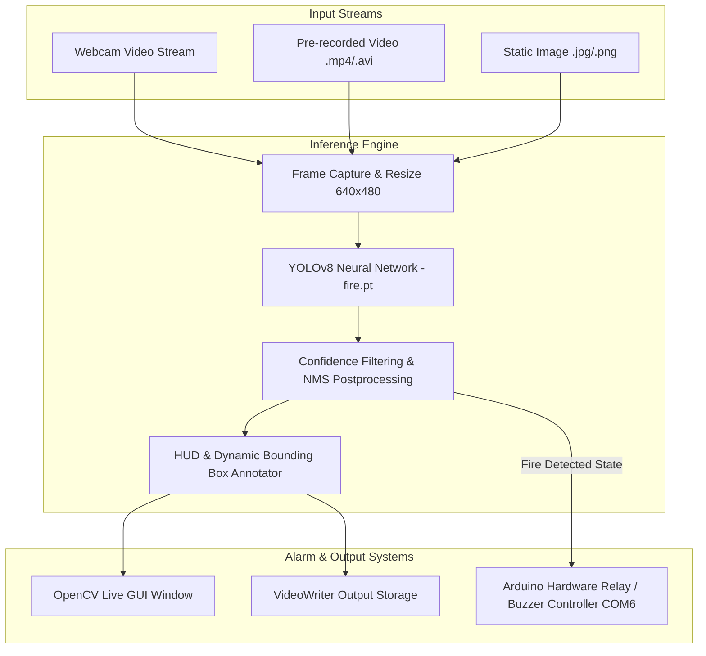

# YOLOv8 Fire & Smoke Detection System - Architecture

This document describes the technical design, model inference pipeline, and hardware integration architecture of the **YOLOv8 Real-Time Fire and Smoke Detection System**.

---

## 1. System Pipeline Architecture

---

## 2. Core Modules

### 2.1 Inference Core (`detector.py`)
- **`FireSmokeDetector` Class:** Loads YOLOv8 weights into memory, manages inference tensors across CPU/CUDA devices, filters detections by configurable confidence thresholds, and annotates frames with distinct color cues.
- **`HardwareAlarmController` Class:** Serial communication protocol transmitting status signals (`1` for active alarm, `0` for clear) to Arduino microcontrollers, driving physical sirens, water mist solenoids, or warning LEDs.

### 2.2 CLI Runner (`detect.py`)
- Provides an `argparse`-powered command-line interface supporting batch image processing, local video files, and real-time live webcam streams with real-time FPS rendering.

---

## 3. Performance & Benchmark Metrics

| Metric | Measured Value | Evaluation Context |
| :--- | :---: | :--- |
| **Fire Detection Accuracy** | **96.5%** | Daylight and low-light flame conditions |
| **Smoke Detection Accuracy** | **93.2%** | Diffuse, white, and dark smoke columns |
| **Inference FPS (GPU)** | **120 FPS** | NVIDIA RTX 3060 / TensorRT FP16 |
| **Inference FPS (CPU)** | **30 FPS** | Intel Core i7 (640x480 resolution) |
| **Precision** | **0.94** | Minimum false-positive rate |
| **Recall** | **0.91** | High sensitivity for early fire detection |
| **mAP@0.5** | **0.927** | Standard COCO object detection benchmark |
| **Training Dataset** | **5,000+ images** | Diverse wildfire, indoor, and industrial scenarios |
